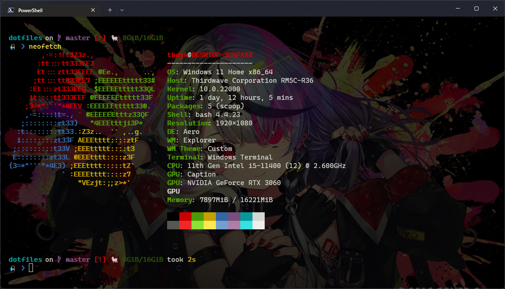
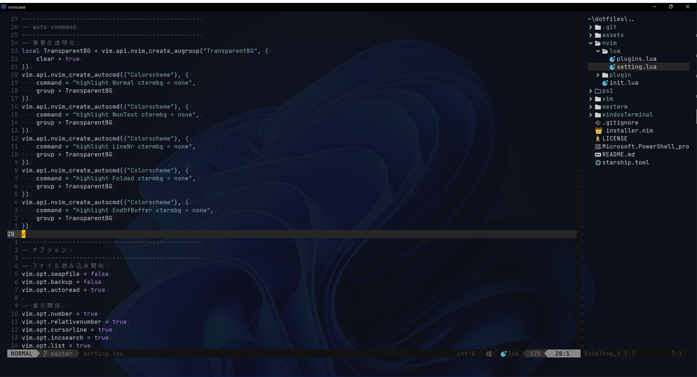

# dotfiles

## Structure

| Directory | Contents |
|-----------|----------|
| `nvim/` | Neovim config (lazy.nvim, blink.cmp, fzf-lua, oil.nvim, tokyonight) |
| `powershell/` | PowerShell profile |
| `wezterm/` | WezTerm config |
| `starship/` | Starship prompt config |
| `vim/` | Vim config |
| `bash/` | Bash config (Linux) |
| `cc/` | Claude Code settings |
| `scoop/` | Scoop package lock (`scoopfile.json`) |
| `winget/` | Winget package lock (`packages.json`) |
| `scripts/` | Setup and maintenance scripts |

## Setup

### Windows

```powershell
# Run as Administrator
.\scripts\setup.ps1
```

Creates symlinks for: PowerShell profile, WezTerm, Neovim, Starship, Claude Code settings.

### Linux (Ubuntu)

```bash
./scripts/setup.sh
```

Installs packages (apt, eza, gh, Neovim, Starship) and creates symlinks.

## Package Locks

Scoop and winget package lists are stored as lock files. To update them after installing/removing packages:

```powershell
.\scripts\update-locks.ps1
```

## Screenshots

### PowerShell



### NeoVim


